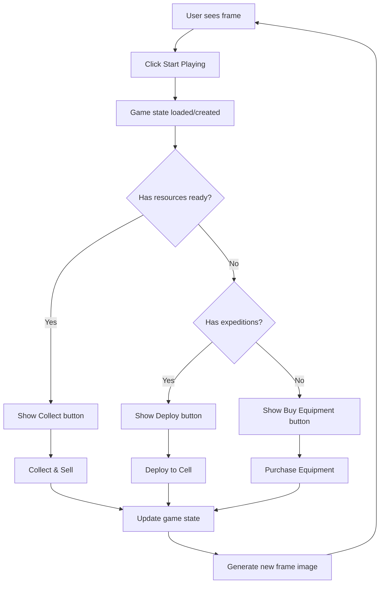

# 🎯 Farcaster Integration Setup for Farpost

This guide will help you integrate your Farpost lunar mining game with Farcaster Frames, allowing users to play directly within Farcaster clients like Warpcast.

## 🚀 Overview

The Farcaster integration enables:
- **Frame-based gameplay** - Play within Farcaster feeds
- **Social sharing** - Share game progress and achievements
- **User authentication** - Automatic login via Farcaster ID
- **Persistent state** - Save progress across sessions
- **Dynamic images** - Real-time game state visualization

## 📋 Prerequisites

- Existing Farpost game deployment on Netlify
- Supabase account and project set up
- Domain name (for production frames)
- Node.js 16+ for local development

## 🛠️ Step 1: Install Dependencies

```bash
npm install
```

The following packages have been added:
- `frames.js` - Frame development utilities
- `@farcaster/hub-nodejs` - Farcaster Hub SDK
- `viem` - Ethereum utilities (for future Web3 features)

## 🔧 Step 2: Update Configuration

### Update `js/config.js`

Replace placeholder URLs with your actual Supabase credentials:

```javascript
const config = {
  supabase: {
    url: 'https://your-project.supabase.co',
    anonKey: 'your-anon-key-here'
  },
  // ... rest of config
};
```

### Update Frame Meta Tags in `index.html`

Replace `https://your-domain.com` with your actual domain:

```html
<meta property="og:image" content="https://yoursite.netlify.app/api/frame-image?level=1&points=1000&cells=3&extracting=0&ready=0">
<meta property="fc:frame:image" content="https://yoursite.netlify.app/api/frame-image?level=1&points=1000&cells=3&extracting=0&ready=0">
<meta property="fc:frame:post_url" content="https://yoursite.netlify.app/api/frame">
```

## 🗄️ Step 3: Database Setup

Add Farcaster-specific tables to your Supabase database:

```sql
-- Add farcaster_id to player_profiles
ALTER TABLE player_profiles 
ADD COLUMN farcaster_id TEXT UNIQUE,
ADD COLUMN farcaster_username TEXT,
ADD COLUMN farcaster_display_name TEXT,
ADD COLUMN farcaster_pfp_url TEXT;

-- Create index for faster lookups
CREATE INDEX idx_player_profiles_farcaster_id ON player_profiles(farcaster_id);

-- Update RLS policies to include Farcaster authentication
CREATE POLICY "Users can access their own profile via Farcaster ID" 
ON player_profiles FOR ALL 
USING (
  auth.uid() = user_id OR 
  farcaster_id = current_setting('app.current_fid', true)
);
```

## 🚀 Step 4: Deploy to Netlify

### Environment Variables

Add these to your Netlify environment variables:

```
SUPABASE_URL=https://your-project.supabase.co
SUPABASE_ANON_KEY=your-anon-key-here
SUPABASE_SERVICE_ROLE_KEY=your-service-role-key
FARCASTER_HUB_URL=https://hub-api.farcaster.xyz:2281
```

### Deploy

```bash
# Deploy to Netlify
npm run deploy

# Or use Netlify CLI
netlify deploy --prod
```

## 📱 Step 5: Testing Your Frame

### Local Testing

1. Start local development:
   ```bash
   npm run dev
   ```

2. Use a tool like [Frame Debugger](https://debugger.framesjs.org/) to test your frame
3. Enter your local URL: `http://localhost:8888/api/frame`

### Production Testing

1. Deploy your site to Netlify
2. Use the Frame Debugger with your production URL
3. Test in Warpcast by sharing your frame URL

## 🎮 Step 6: Frame Functionality

### Available Actions

Your frame supports these interactions:

1. **Start Playing** - Initialize or continue game
2. **Buy Equipment** - Purchase expeditions and boosters
3. **Deploy to Cell** - Start resource extraction
4. **Collect Resources** - Harvest and sell resources
5. **Open Game** - Link to full game experience

### Frame Flow



## 🔧 Customization

### Modify Frame Images

Edit `netlify/functions/frame-image.js` to customize:
- Colors and styling
- Layout and components
- Game state visualization
- Error messages

### Add New Actions

1. Add button in `netlify/functions/frame.js`
2. Create handler function
3. Update frame response logic
4. Test with Frame Debugger

### Example: Add Leaderboard

```javascript
// In frame.js
case 5: // Leaderboard action
  actionResult = await handleLeaderboardAction(fid, gameState);
  break;

async function handleLeaderboardAction(fid, gameState) {
  // Fetch top players from database
  const topPlayers = await getTopPlayers();
  
  return {
    success: true,
    message: `Leaderboard: You're rank #${getUserRank(fid, topPlayers)}!`,
    gameState: gameState
  };
}
```

## 🔍 Debugging

### Common Issues

1. **Frame not loading**
   - Check meta tags are correctly formatted
   - Verify image URLs are accessible
   - Check Netlify function logs

2. **Button actions failing**
   - Verify POST endpoint is working
   - Check request/response format
   - Validate Farcaster message structure

3. **Images not generating**
   - Test image endpoint directly
   - Check SVG syntax
   - Verify query parameters

### Debug Tools

- **Netlify Function Logs**: Check for server errors
- **Frame Debugger**: Test frame functionality
- **Browser Console**: Check client-side errors
- **Network Tab**: Inspect API requests

## 🚀 Production Checklist

- [ ] Update all placeholder URLs to production domain
- [ ] Set up proper environment variables
- [ ] Test frame in Farcaster clients
- [ ] Verify database permissions
- [ ] Enable frame validation (optional but recommended)
- [ ] Set up monitoring and error tracking
- [ ] Test user authentication flow
- [ ] Verify game state persistence

## 📈 Analytics and Monitoring

### Track Frame Performance

Add analytics to measure:
- Frame view count
- Button click rates
- User retention
- Game progression

### Example Analytics Integration

```javascript
// In frame.js
const analytics = {
  trackFrameView: (fid) => {
    // Log frame view
  },
  trackButtonClick: (fid, buttonIndex) => {
    // Log button interaction
  },
  trackGameAction: (fid, action, result) => {
    // Log game actions
  }
};
```

## 🔮 Future Enhancements

### Planned Features

- **Multi-player interactions** - Player-to-player trading
- **Farcaster-native rewards** - Token integration
- **Social features** - Share achievements, form alliances
- **Real-time updates** - Live game state synchronization
- **Advanced frames** - Multi-step interactions

### Web3 Integration

```javascript
// Future: Add wallet connection for token rewards
const web3Features = {
  connectWallet: async (fid) => {
    // Connect user's wallet
  },
  distributeRewards: async (fid, amount) => {
    // Send tokens for achievements
  },
  enableTrading: async (fid1, fid2, resources) => {
    // Facilitate resource trading
  }
};
```

## 🆘 Support

Need help? Check these resources:

- [Farcaster Frames Documentation](https://docs.farcaster.xyz/learn/what-is-farcaster/frames)
- [Frames.js Documentation](https://framesjs.org/)
- [Supabase Documentation](https://supabase.com/docs)
- [Netlify Functions Documentation](https://docs.netlify.com/functions/overview/)

## 📄 License

This integration maintains the same license as the main Farpost project.

---

**Happy Frame Building! 🎯🌙** 